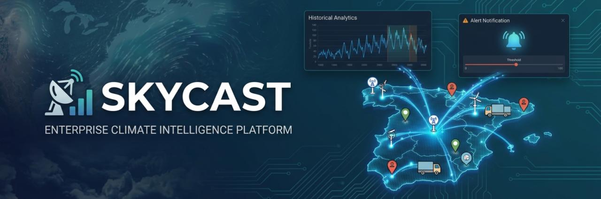

<p align="center">
  
</p>

# SKY CAST — Enterprise Climate Intelligence Platform


> **From generic weather apps to enterprise climate intelligence. Official AEMET data + crowdsourcing (Waze model) + smart alerts + REST API.**

---

## Elevator Pitch

**Problem**: Generic weather apps show "23°C and sunny" — but a city council needs to know if tomorrow's wind will exceed 50 km/h to close parks, and a logistics company needs to decide whether to delay fleets due to heavy rain on a specific route. No solution combines official data with collaborative intelligence for enterprise decision-making.

**Hypothesis**: Combining official AEMET data with geo-validated crowdsourcing (Waze model) and configurable alert thresholds can create a climate intelligence system that outperforms generic apps and delivers real value to councils, logistics companies, and enterprises.

**Solution**: SkyCast — a platform that evolved through **4 phases** (from Streamlit + CSV prototype to production-grade FastAPI + PostgreSQL + Docker + CI/CD), integrating AEMET OpenData, collaborative reports, smart alerts, documented REST API, and **158 automated tests** ensuring production quality.

---

## Problem

Generic weather apps don't cover specific business needs:

- A **city council** needs to know if tomorrow's wind > 50 km/h to close parks, not just "23°C and sunny".
- A **logistics company** needs to decide whether to delay fleets due to heavy rain on a specific route.
- A **municipal technician** cross-references official sensor data with citizen reports to decide whether to activate a frost protocol.

SkyCast solves this by combining **official data** (AEMET OpenData), **crowdsourcing** (geo-validated manual reports), and **analytics** (alerts, anomalies, historical trends).

## Key Metrics

| Metric | Value |
|--------|-------|
| Automated Tests | **158** (33 files, 0 failures) |
| API Endpoints | **10+** (REST + Swagger) |
| Data Sources | AEMET OpenData + OpenWeatherMap (fallback) + Crowdsourcing |
| Refresh Rate | Every **2 hours** (APScheduler) |
| Security | JWT + SHA-256 + salt + rate limiting |
| Architecture Layers | 4 (API, Dashboard, ETL, Scheduling) |
| Evolution Phases | 4 (V1 protoype -> Production) |
| Database Models | **9** (SQLAlchemy ORM) |
| Test Coverage | Auth, Alerts, Validators, ETL, Anomaly Detection, Cache, Lineage |

## Differentiator

| Factor | Generic Weather Apps | SkyCast |
|--------|---------------------|---------|
| Data Source | Private API | AEMET OpenData (official Spain) |
| Crowdsourcing | No | Geo-validated manual reports |
| Alerts | Generic | User-configurable thresholds |
| Historical Data | Limited | Full CRUD + ETL with lineage |
| Third-party API | No | Documented REST (Swagger) |
| Audience | Consumer | Businesses, councils, logistics |

## Architecture

```
FastAPI + Pydantic -- REST API --+
                                  +-- PostgreSQL (SQLAlchemy ORM)
Streamlit + Plotly --- Dashboard -+
                                  |
APScheduler --- AEMET API --------+
    (every 2h, fallback OpenWeatherMap)
```

### ETL Flow (full lineage)

```
Extract (AEMET JSON) -> Transform (Pandas: nulls, duplicates, types)
                      -> Load (SQLAlchemy) -> LineageLogger (trace)
```

Each step logs input/output/discarded rows with `LineageLogger`.

## Tech Stack

| Layer | Technology |
|-------|-----------|
| API | FastAPI + Uvicorn + Pydantic + async |
| Database | PostgreSQL 16 / SQLite + SQLAlchemy ORM (9 models) |
| Dashboard | Streamlit + Plotly + Geopandas + Folium |
| ETL | Pandas + NumPy + LineageLogger |
| Auth | JWT + SHA-256 + unique salt |
| Cache | Redis (optional, in-memory fallback) |
| Scheduling | APScheduler (AEMET fetch every 2h) |
| Containers | Docker + Docker Compose |
| CI/CD | GitHub Actions (pytest + ruff + Docker build) |
| Testing | 158 tests, pytest + httpx, pre-push hooks |

## Quick Start

```bash
git clone https://github.com/juandelaf1/SkyCast.git
cd SkyCast
python -m venv .venv
pip install -r requirements.txt
cp .env.example .env   # Add AEMET_API_KEY
python -m app.db       # Init DB
uvicorn app.main:app --reload --port 8000
streamlit run app/dashboard/app.py --server.port 8501
```

Docs: http://localhost:8000/docs | Dashboard: http://localhost:8501

## API Endpoints

| Method | Endpoint | Description |
|--------|----------|-------------|
| POST | `/api/v1/auth/register` | Register |
| POST | `/api/v1/auth/login` | JWT Login |
| GET | `/api/v1/clima?lat=&lon=` | Current weather |
| GET | `/api/v1/geo/{city}` | Geocoding |
| GET | `/api/v1/registros?page=&limit=` | Paginated history |
| POST | `/api/v1/registros` | Manual report (crowdsourcing) |
| POST | `/api/v1/comparar` | Manual vs AEMET |
| GET/POST | `/api/v1/alertas` | Configurable thresholds |

## Security

- Passwords: SHA-256 + salt (16 bytes) per user
- Tokens: JWT HS256, 24h expiration
- Validation: Pydantic + physical ranges (-20/60°C, 0-100% humidity)
- Rate limiting: slowapi (30 req/min climate, 10 geo)
- Pre-push hooks: lint + tests + anti-leak secrets

## Quality (158 tests, 0 failures, CI/CD)

```bash
pytest --cov=app --cov-report=html   # 158 tests, 33 files
ruff check app/ tests/               # 0 errors
```

Coverage: API endpoints, auth, alerts, validators, ETL (extract/transform/load), haversine, anomaly detection, cache, lineage logger, external services mocked.

## Vision: Logistics Platform

SkyCast is designed as the **climate module** of a larger logistics platform. REST endpoints allow routing, fleet, and insurance systems to consume historical and real-time climate data without coupling. Natural next steps:

1. Push alerts (email/Telegram) for personalized thresholds
2. Geo-fences: trigger alerts when locations exceed thresholds
3. Routing API integration (calculate weather-related delays)
4. Predictive model (temp/humidity regression to 48h)

---

## Project Evolution

| Phase | Project | Stack | Milestone |
|-------|---------|-------|-----------|
| F1 | [SkyCast V1](https://github.com/juandelaf1/SkyCast-V1) | Streamlit + CSV | Functional prototype |
| F2 | [ClimApp](https://github.com/juandelaf1/ClimApp) | Flask MVC + AEMET | Layered architecture, 66 tests |
| F3 | [Vortex](https://github.com/juandelaf1/Vortex) | FastAPI/Flask + PostgreSQL | ETL, lineage, traceability |
| F4-Pre | [SkyCast V2 Pre](https://github.com/juandelaf1/SkyCast-V2-Pre) | FastAPI + Docker | JWT with salt, anomalies |
| **F4** | **SkyCast** | **FastAPI + PostgreSQL + Docker** | **158 tests, CI/CD, production-ready** |

---

## Author

**Juan de la Fuente** — [@juandelaf1](https://github.com/juandelaf1)

juandelafuentelarrocca@gmail.com

MIT © 2026
